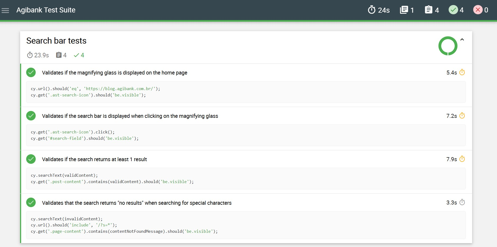

# Teste técnico para vaga de QA Senior na Ilegra/Agibank

## 🚀 Funcionalidades
### Suíte de testes 
* ✔️ Cypress, usado para criar e rodar a automação de testes E2E.

### Qualidade de código
* ✔️ Eslint-Plugin-Cypress, analisador estático do código para encontrar bugs, estilos de codificação questionáveis e construções suspeitas.
* ✔️ Prettier, ferramenta de regras de formatação para um código consistente.

### CI/CD
* ✔️ Testes automatizados com Cypress e verificação de codigo com Eslint sendo executados na pipeline do [GitHub Actions](https://github.com/thaynaracdutra/ilegra-agibank-test/actions)

### Cenários de testes executados
* ✔️ Valida se a lupa é exibida com sucesso na página inicial para iniciar uma pesquisa
* ✔️ Valida se a barra de pesquisa é exibida ao clicar na lupa
* ✔️ Valida se uma pesquisa por um termo válido retorna pelo menos 1 resultado
* ✔️ Valida a pesquisa retorna "nenhum resultado" ao buscar por caracteres especiais

## 💻 Pré-requisitos para rodar o projeto na sua maquina 💻

* Ter instalado uma IDE de sua preferencia, nesse projeto utilizamos o VS Code.
* Ter instalado a versão npm v11.2.0 e node v22.14.0.

## ⚙️ Configurando o projeto na sua maquina ⚙️

Inicialmente, você deve clonar o projeto para sua máquina, caso tenha dúvidas de como fazer você pode seguir o passo a passo [aqui](https://docs.github.com/pt/repositories/creating-and-managing-repositories/cloning-a-repository).

Link para clonagem do projeto:
```
git clone https://github.com/thaynaracdutra/ilegra-agibank-test.git
```

Após clonar o repositório para sua máquina você deverá instalar as dependencias do projeto inserindo o comando abaixo no seu terminal:
```
npm install
```

## ⚙️ Executando os testes automatizados ⚙️

Para executar os testes em modo headless, você pode inserir o comando abaixo no terminal:
```
npm run cypress:run
```

Para executar os testes em modo headed em um navegador, você pode inserir o comando abaixo no terminal, selecionar E2E testing e o navegador desejado:
```
npm run cypress:open
```

Ao finalizar, todos os testes devem ter sido realizados sem falhas.

## ⏺️ Evidencia dos testes executados ⏺️

Evidencia dos testes executados e reportados pelo framework Mochawesome reporter.
<p align="center"></p>


## ⚡ Comentários do autor ⚡

* Este projeto conta com a execução via pipeline GitHub Actions, que é executada a cada push e pode ter suas execuções visualizadas [aqui](https://github.com/thaynaracdutra/ilegra-agibank-test/actions).
* Foi decidido utilizar o framework Cypress sem o uso de Page Objects para a criação de um código mais simples e de fácil manutenção. 
* Estando no time, com certeza incentivaria o time de desenvolvimento a adicionar data elements mais especificos nos componentes para tornar o código mais legivel. 
